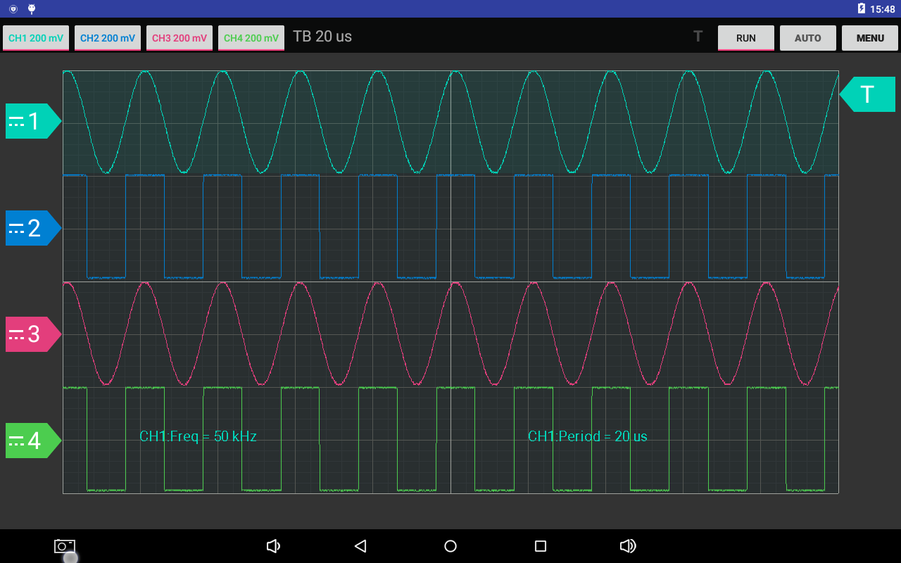

# Hantek6000 android APP

The Hantek6074 device have no official android APP. I decide to implement one.

## Supported Device

- Hantek6074BE

The bellow devices has not been tested, but I think it is also supported.

- Hantek6004BC series: Hantek6074BC/Hantek6104BC/Hantek6204BC/Hantek6254BC
- Hantek6004BD series: Hantek6074BD/Hantek6104BD/Hantek6204BD/Hantek6254BD

## Todo

1. draw coupling indicator on channel zero level marker
2. voltage adjust by gesture
3. adjust by gesture
   1. gesutre
   2. dropdown list
4. automeasure
5. atuoset
6. cusormeasure
7. menu
8. factorysetup
9. self calibration