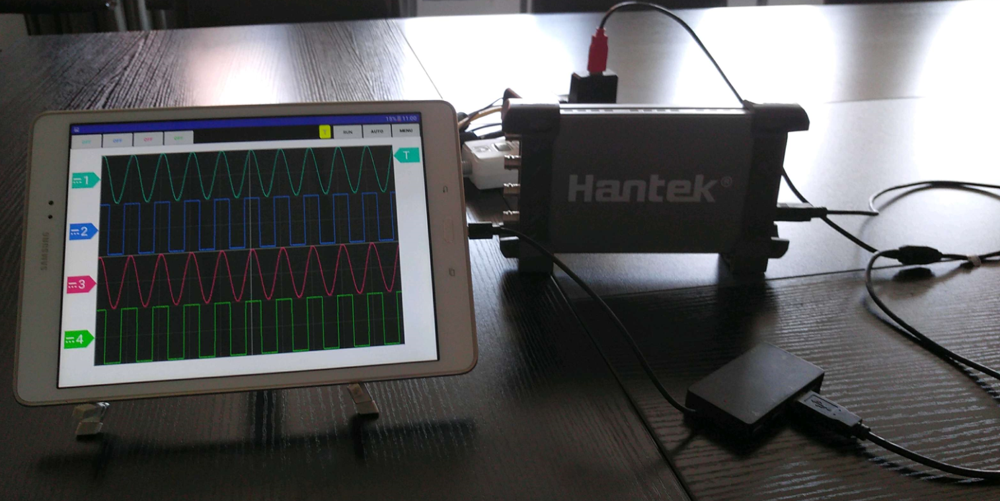

# Hantek60x4 android APP

Hantek60x4 is a free Android APP for Hantek60x4 device.

The Hantek60x4 device have no official Android APP. This is a reverse engineered implementation of the 4 channel digital storage oscilloscope Hantek6074BE from Hantek.It communicates with the device over USB via OTG adapter.

## Supported Device

- Hantek6074BE
- Hantek6004BC series: Hantek6074BC/Hantek6104BC/Hantek6204BC/Hantek6254BC
- Hantek6004BD series: Hantek6074BD/Hantek6104BD/Hantek6204BD/Hantek6254BD

## Features

- Touch friendly operation
- Operate the oscilloscope intuitively
- Adjust volts/div and time/div by pinch gesture

## Download

Download the latest release from [release page](https://github.com/hackhantek/hantek6004/releases).

## Todo

1. ~~Open/Close channel~~
2. ~~Change channel zero level by drag zero level marker~~
3. ~~Change trigger zerol level by drag trigger zero level marker~~
4. ~~RUN/STOP~~
5. ~~Qucik channel settings by tap zero level marker.~~
6. ~~Quick trigger settings by tap zero level marker.~~
7. ~~Draw coupling indicator on channel zero level marker~~
8. ~~Atuoset~~
9. ~~Voltage adjust by gesture~~
10. ~~Add trigger sweep settings in trigger quick settings~~
11. Timebase adjust by gesture
    1. ~~gesutre~~
    2. dropdown list
12. ~~Menu~~
13. ~~Automeasure~~
14. Factorysetup
15. Self calibration
16. Cusor Measure
17. Record
18. Change channel zero level by drag channel wave

## Other

- Android OS requriment: 4.3 or higher

- Product page: http://www.hantek.com/en/ProductDetail_13_10163.html
